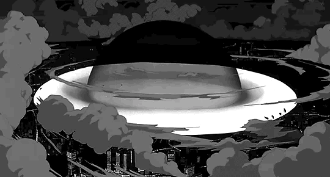

  

  <table >
    <tr>
      <td>
        <h3>💫 About Me:</h3>
        
🦅 Web Designer  ğŸ Passionate about creating beautiful, creative, and functional websites with eye-stunning animations and visuals ✨  🷠I believe in your amazing ideas and am dedicated to bringing them to life with my creativity. âš¡ Up to date with the latest animations and trending layouts in the market for better service
      </td>
      <td>
        
      </td>
    </tr>
  </table>

